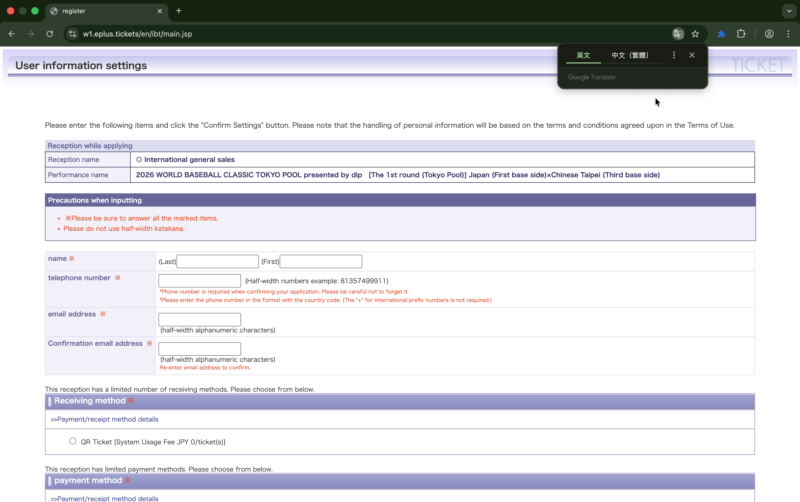

# eplus Ticket Autofill Extension

This Chrome Extension is specifically designed to automate form filling for the **WBC eplus** ticket website:
https://eplus.tickets/en/sf/ibt/sports/baseball/wbc

It helps users quickly fill in contact, payment, and personal information on the registration pages.

## Features
- **Secure Local Storage**: All user data is stored locally in your browser (`chrome.storage.local`). **No data is ever sent to external servers.**
- **One-Click Autofill**: Fill complex forms instantly.

> [!WARNING]
> **Note on Site Updates**: This extension is optimized for the current structure of the eplus website. If the website updates its DOM structure before the ticket sale, this tool may require an update. Please check for the latest version before the sale begins.

## Installation

1. Clone or download this repository.
2. Open Chrome and navigate to `chrome://extensions/`.
3. Enable **Developer mode** in the top right corner.
4. Click **Load unpacked**.
5. Select the folder containing this repository.

## Usage

1. Click the extension icon in your toolbar.
2. Enter your information (Name, Phone, Credit Card, etc.).
3. Click **Save Settings**.
4. Navigate to the target ticket page.
5. Click the extension icon and press **Autofill**.

## Security

- **Network Isolation**: This extension has no network permissions (`host_permissions`) in `manifest.json`. It cannot send your data to the internet.
- **Local Data**: Your sensitive information (credit card, personal info) stays on your machine.

## Disclaimer

**IMPORTANT: PLEASE READ BEFORE USE**

This software is provided "as is", without warranty of any kind, express or implied. By using this software, you agree that:

1.  **Use at Your Own Risk**: You are solely responsible for how you use this tool.
2.  **No Liability**: The authors are not responsible for any damages found, including but not limited to:
    - Account bans or restrictions on the target platform.
    - Failed transactions or missed tickets.
    - Accidental data leakage due to user misuse.
3.  **Compliance**: You agree to use this tool in compliance with the Terms of Service of the websites you visit.

## License

MIT License. See [LICENSE](LICENSE) file for details.
